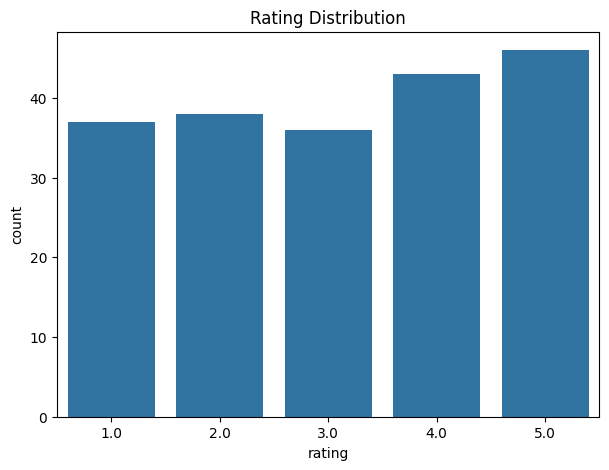
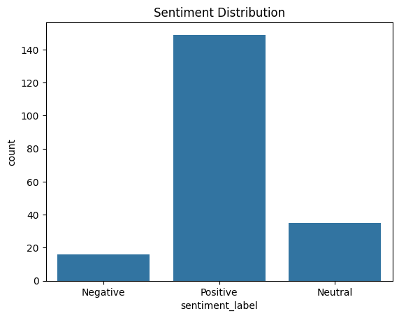
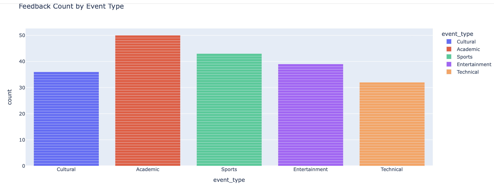
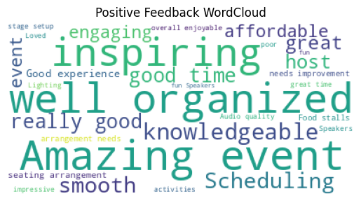

## 📌 Internship Projects (Future Interns)

This internship consisted of **three project-based tasks**:

### 🔹 Task 1: Business Sales Dashboard
🔗 https://github.com/Vish1428/FUTURE_DS_01

### 🔹 Task 2: Social Media Campaign Performance Analysis
🔗 https://github.com/Vish1428/FUTURE_DS_02

### 🔹 Task 3: College Event Feedback Analysis
🔗 https://github.com/Vish1428/FUTURE_DS_03

📊 College Event Feedback Analysis — Internship Project (Task 3)

Future Interns — Data Science & Analytics Track (DS_03)

This project analyzes student feedback from college events to uncover insights related to satisfaction, sentiment, and areas for improvement. The analysis uses Python, pandas, Plotly, and NLP sentiment scoring.

🔍 Project Objectives

Understand student satisfaction with events

Analyze sentiment from open feedback

Identify top-performing event types

Highlight improvement areas

Provide data-driven recommendations

📁 Dataset

File: cleaned_event_feedback.csv

Contains 200 responses with:

Rating

Event type

Satisfaction score

Department

Feedback comments

Suggestions

📊 Key Visualizations

⭐ Rating Distribution

⭐ Sentiment Distribution

⭐ Event Type Participation

⭐ Overall Satisfaction Distribution

⭐ WordCloud (Positive Feedback)

🧠 Insights Summary

44.5% students gave 4★ or 5★ ratings

Majority sentiment is positive

Students loved:

Event organization

Speakers & sessions

Smooth coordination

Improvement requested:

Better seating

Reduced waiting time

More engaging activities

🛠️ Tools Used

Python

pandas

seaborn

Plotly

TextBlob

WordCloud

Google Colab

🙌 Author

Vraj Shrimali

Future Interns — Data Science & Analytics Track
